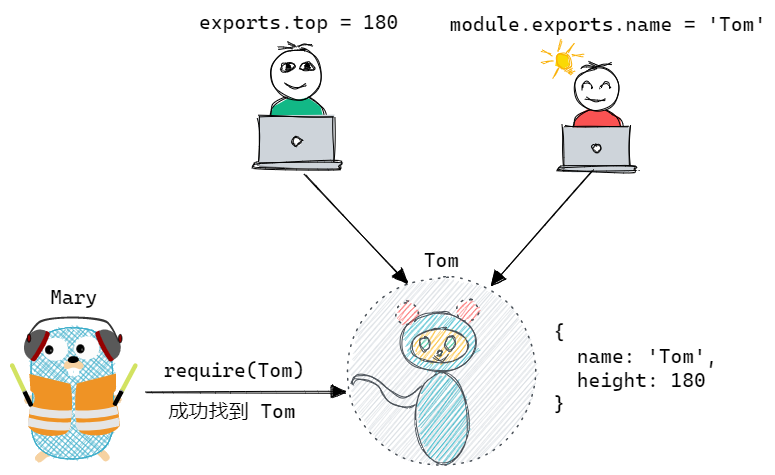
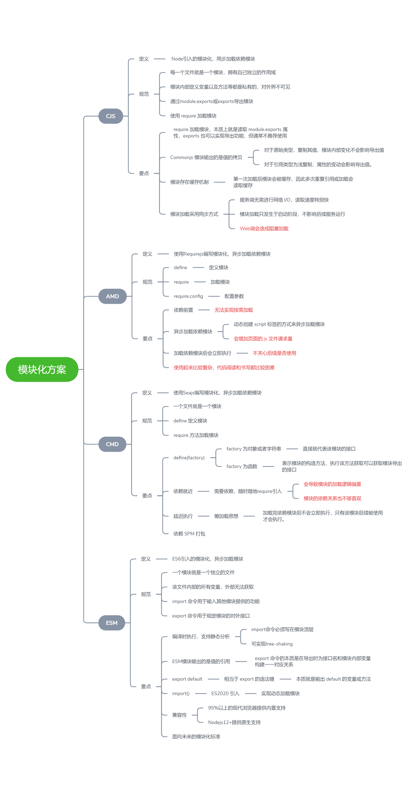

## 写在前面

上一篇《》探讨了早期模块化的探索历程: 最开始文件划分方式实现简单的代码逻辑划分 --> 命名空间减少命名冲突 --> IIFE 构建私有作用域 --> IIFE 引入依赖实现简单的依赖管理 --> 依赖注入降低模块依赖间的耦合度

经过早期模块化方案的学习，这里先引入两个思考：

1. 模块化到底要解决那些问题？

在我看来最核心诉求主要有三点: **命名冲突、依赖管理、全局污染**。

2. 完善的模块化标准应该是什么样子的？

<!--  -->

经历了早期模块化方案探索的混沌时期，后续开始逐渐出现一系列业界认可的模块化规范：Commonjs、AMD、CMD、ESModule 规范。

- 四种模块化规范有何异同，又各自具备何种特色
- 主流规范大 PK: Commonjs 规范 VS ESModule 规范，
- 面向未来的模块化规范 ESModule 底气何在

接下来将为你一次一次揭晓，如果想迅速知晓答案，可传送至[总结篇]()查看思维导图。

## Commonjs 规范

### 基本使用

Commonjs 是业界最早提出的模块化规范，主要应用于服务器端，Nodejs 的模块系统便是 Commonjs 规范的最佳践行者。

Commonjs 模块化规范实现围绕四个核心环境变量:

- module: 每个模块内部都存有 module 对象代表当前模块
- exports: 通过 exports(或 module.exports) 暴露模块内部属性
- require: 使用 require 来实现模块加载
- global: 全局上下文环境

学会核心四大环境变量后，Commonjs 规范就顺理成章了:

- 每一个文件就是一个模块，拥有自己独立的作用域。
- 模块内部定义变量以及方法等都是私有的，对外界不可见。
- module 对象的 exports(或 module.exports) 属性是对外的接口，加载某个模块，实际上就是加载该模块的 module.exports 属性(不推荐直接使用 exports)
- 使用 require 加载模块

Commonjs 使用起来比较简单，下面咱们来尝试一下:

```js
// 导出模块
// moduleA.js
const moduleName = "moduleA";
const add = function (a, b) {
  return a + b;
};
module.exports = {
  moduleName,
  add,
};
```

```js
// 加载模块
// entry.js
const moduleA = require("./moduleA");
console.log(moduleA.moduleName); // moduleA
console.log(moduleA.add(1, 2)); // 3
```

### 核心要点

> Tips1: require 加载模块，本质上就是读取 module.exports 属性，exports 也可以实现导出功能，但通常不推荐使用

module.exports 和 exports 在模块中默认情况下**指向同一地址空间，等价；但若后续发生地址层面的修改，两者就会产生差异，造成导出内容存在问题。**

下面咱们来模拟一个简单场景: Mary 要去找 Tom 玩，但她不知道 Tom 家在哪里，只知道 Tom 的 name 和 height，module.exports 和 exports 先生是 Tom 的邻居，于是 Mary 就去找他们询问 Tom。

```js
// Mary.js
const Tom = require("./Tom");
if (Tom.name === "Tom" && Tom.height === 180) {
  console.log("成功找到 Tom");
} else {
  console.log("未能找到 Tom");
}
```

第一种情形: module.exports 和 exports 分别提供了一条线索

```js
// Tom.js
module.exports.name = "Tom";
exports.height = 180;
```

<!--  -->

第二种情形: module.exports 指向了另一个同名 Tom，而 exports 仍指向原来的 Tom，require 默认导出 module.exports，因此最终 Mary 只能获得 Tom.name，不能完全确认 Tom 身份。

```js
module.exports = {
  name: "Tom",
};
exports.height = 180;
```

<!--  -->

第三种情形: exports 指向了另一个 Tom，而 require 获取 module.exports 上接口，因此 exports 提供的线索一律不予采纳。

```js
module.exports.name = "Tom";
exports = {
  height: 180,
};
```

<!--  -->

module.exports 与 exports 全部指向新空间类似于第二
种情形，这里不做描述了。

> Tips2: Commonjs 模块输出的是值的拷贝，对于原始类型，复制其值，模块内部的变化不会影响导出值；对于引用类型为浅复制，属性的变动会影响导出值。

```js
// moduleA.js
let count = 0;
let obj = {
  count: 0,
};
let add = () => {
  count++;
  obj.count++;
};
let alterObj = () => {
  obj = {
    newCount: 0,
  };
};

module.exports = { count, add, obj, alterObj };
```

```js
// entry.js
const { count, add, obj, alterObj } = require("./moduleA");
console.log("count: ", count, " obj.count:", obj.count); // count:  0  obj.count: 0
add();
console.log("count: ", count, " obj.count:", obj.count); // count:  0  obj.count: 1

console.log("obj", obj); // obj { count: 1 }
alterObj();
console.log("obj", obj); // obj { count: 1 }
```

通过上述案例，Commonjs 引用的机制非常类似于 ES6 const 语法，基本类型不会变化，引用类型只会发生属性级别的变化。

> Tips3: 模块存在缓存机制，第一次加载后模块会被缓存，因此多次重复引用或加载会读取缓存

> Tips4: 模块加载采用同步方式

Commonjs 应用于服务端，模块存放在本地磁盘上，不需要进行网络 I/O，读取速度特别快；此外，服务端启动后通常会一直运行，模块读取只发生在服务启动阶段，这种模式并不会影响服务的性能。而在浏览器端则存在大量的异步操作，使用 Commonjs 规范会造成浏览器 JS 解析过程的阻塞，严重影响页面加载速度。

可见 Commonjs 并不适用于浏览器端，因此业界后续又设计出了全新的异步加载规范应用于浏览器端，下面来依次介绍一下。

> 对于 Commonjs 的具体实现源码，将在下一章详细进行讲解。

## AMD 规范

### 基本使用

AMD 全称为 Asynchronous Module Definition，即异步模块定义规范。借助该规范，浏览器端可以实现模块异步加载，避免同步加载的页面阻塞。

AMD 规范是一种标准，没有得到浏览器端的原生支持，使用它需要借助第三方实现，[requireJS](https://github.com/requirejs/requirejs) 是最经典的库，其完整实现了 AMD 规范，后续的使用基于 requireJS。

requireJS 提供了三个核心方法

- define 定义模块
- require 加载模块
- require.config 指定引用路径

下面来建立一个项目，项目结构如下:

```
├── index.html
├── scripts
│   ├── utils.js
│   |   └── print.js
│   ├── require.js
│   └── entry.js
```

然后看一下具体使用

```js
// 网页中引入 requirejs 以及模块入口
<script src="./scripts/require.js" data-main="./scripts/entry"></script>;

// entry.js
require.config({
  baseUrl: "scripts/utils",
});

require(["print"], function (printModule) {
  printModule.print("entry");
});

// print.js
define(function () {
  return {
    print: function (msg) {
      console.log("print " + msg);
    },
  };
});
```

更多使用请参考 [requirejs 文档](https://requirejs.org/docs/start.html)

### 核心要点

回看 requirejs 的模块加载方式，是不是有几分眼熟，没错，这里的思想类似于上一篇文章中的**依赖注入**思想。

```js
require(["print"], function (printModule) {
  printModule.print("entry");
});
```

但在 requirejs 中，有一个更标准的称呼——依赖前置。依赖前置是 AMD 的核心设计思想，AMD 通过**动态创建 script 标签的方式来异步加载模块**，加载完成后立即执行该模块，所有的依赖加载并执行完毕后，本模块才会执行。

基于依赖前置的 requirejs 成功实现了异步模块加载，同时也暴露出很多问题

- AMD 加载依赖模块后会立即执行，并不考虑该该依赖模块后续是否会被使用
- AMD 异步加载模块通过动态创建 script 标签实现，这会提高页面的 js 文件请求量
- AMD 依赖前置的模式要求必须提前写好所需依赖，无法实现按需加载
- AMD 规范使用起来稍显复杂，代码阅读和书写都比较困难

综上所述，AMD 规范只能说是前端模块化探索过程中的中间方案，距离现代模块化方案还相差甚远。

## CMD 规范

### 基本使用

CMD(Common Module Definition)规范是另一种异步模块化解决方案，它出现相对较晚，是在 Seajs 推广过程中产生的，其吸收了 AMD 和 Commonjs 规范的一些优点。

CMD 规范规定：

- 一个文件就是一个模块
- define 定义模块
- require 方法加载模块

CMD 规范使用起来非常简单，使用区别就在于 factory 的不同。

- 如果 factory 为对象或者字符串，直接就代表该模块的接口
- 如果 factory 为函数，则表示模块的构造方法，执行该方法获取可以获取模块导出的接口。

```js
define(factory);
```

当 factory 为函数时，其有三个参数: require、exports、module

```js
define(function (require, exports, module) {
  // module content
});
```

### 核心要点

通过基础使用部分，可以发现 CMD 与 AMD 非常类似，下面的案例对比了两者的使用。两者最大的区别在于

```js
// amd
define(["print"], function (printModule) {
  printModule.print("entry");
});

// cmd
define(function (require, exports, module) {
  cosnt printModule = require('./print')
  printModule.print("entry");
});
```

虽然 CMD 与 AMD 比较类似，但两者的设计思想有很大的差异，AMD 推崇**依赖前置**，而 CMD 则主张**依赖就近，延迟执行**。也就是说在 CMD 中，加载完依赖模块后不会立即执行，而是基于一种懒加载的思想，只有该模块后续被使用才会执行。

CMD 规范使用依赖就近的规则定义一个模块，会导致模块的加载逻辑偏重，此外对于当前模块的依赖关系也非常不直观。

## ESModule

### 基本使用

模块化方案关乎到整个前端生态链，官方在 ECMAScript6 标准中增加了 JavaScript 语言层面的模块体系定义，作为浏览器和服务器通用的模块解决方案，也就是 ES6 Module(或称为 ESModule、ESM)。

ESModule 规范并不复杂，使用起来相对也比较简单

- 一个模块就是一个独立的文件。该文件内部的所有变量，外部无法获取
- import 命令用于输入其他模块提供的功能
- export 命令用于规定模块的对外接口

#### export

export 命令可以单个导出，也可以批量导出。

```js
// zcxiaobao.js
// 单个导出
export const firstName = "zc";
export const lastName = "xiaobao";
export const year = 18;

// 批量导出
const firstName = "zc";
const lastName = "xiaobao";
const year = 18;
export { firstName, lastName, year };

// 导入
import { firstName, lastName, year } from "./zcxiaobao.js";
```

与 Commonjs 不同，ESM 导出的为值的引用，因此 export 命令在导出时**需要为接口名和模块内部变量构建一一对应关系**。

例如下面的案例 VSCode 会提示错误。

<!--  -->

ESM 还支持默认导出的功能，即 export default。

```js
// export-default.js
export default function () {
  console.log("foo");
}
```

上述使用 export default 默认输出了一个函数。当然也可以默认导出非匿名函数，但在模块外部并没有任何作用，统统视为匿名函数。

这时你可能会有疑惑？export 与 export default 的导出机制好像有些天差地别，如下面代码，export default 使用 export 格式导出会抛出错误。

```js
// export-default.js
// throw error
export default const foo = function () {
    console.log("foo");
}
```

export default 的本质是将后面的值赋值给 default，这是为什么那？别急，后面马上会讲，import 整体加载更直观，更容易理解。

此外，export default 的定位是模块的默认导出，因此模块内只能使用一次。

#### import

```js
// zcxiaobao.js
const firstName = "zc";
const lastName = "xiaobao";
const year = 18;
export { firstName, lastName, year };

const male = true;
export default male;
```

我们以上面的代码介绍一下 import 的基本使用。

对于 export 命令，import 命令接受一对大括号，里面指定要从其他模块导入的变量名。大括号里面的变量名，必须与被导入模块对外接口的名称相同。

```js
// import-export.js
import { firstName, lastName, year } from "./zcxiaobao.js";
console.log(firstName, lastName, year);
```

由于 ESModule 在编译时运行，因此大括号内不支持运行时才能得到结果表达式和变量。

```js
// import-error.js
// throw error
import { 'first' + 'Name'} from "./zcxiaobao.js";
```

对于 export default 命令，import 导入时可以任意为其重新命名，但切记此时不需要大括号。

```js
// import-default.js
import zcMale from "./zcxiaobao.js";
console.log(Male); // true

// 也可以混合导入
import zcMale, { firstName, lastName } from "./zcxiaobao.js";
console.log(zcMale, firstName, lastName);
```

除了指定加载某些值，import 还支持整体加载。

```js
// import-whole.js
import * as zcxiaobao from "./zcxiaobao.js";
console.log(zcxiaobao);
```

<!--  -->

我们惊喜的发现，default 也出现了，同时与 firstName 等属性是平级的。

上文提过 export 命令的本质是在导出时**需要为接口名和模块内部变量构建一一对应关系**，那是不是意味着 default 是 ESModule 内置构建的默认接口，缺少的只不过是与内部变量的对应关系。

```js
// zcxiaobao2.js
const firstName = "zc";
const male = true;
export { firstName, male as default };

// try
import zcMale, { firstName } from "./zcxiaobao2.js";
console.log(zcMale, firstName); // true,zc
```

也就是说 export default 可以理解为**export 一个特殊的语法糖，本质就是输出 default 的变量或方法**，只不过系统允许随便为它命名。

掌握了 export default 的本质，对于下面的使用错误应该可以轻松找到问题所在。

```js
// zcxiaobao3.js
const firstName = "zc";
const male = true;
export default { firstName, male };

import { firstName, male } from "./zcxiaobao3.js";
```

### ESModule 的发展

#### import()

ESModule 在编译时运行，编译时会对 import 命令进行静态分析，这也就意味着 import 和 export 命令只能在模块的顶层，不能在代码块之中。例如下面的代码就会报错

```js
if (x !== undefined) {
  import { firstName } from "./zcxiaobao.js";
}
```

得益于编译时运行机制，可以实现模块的静态分析，可以实现类似 TreeShaking 等功能减少不必要的代码，但这同样也丧失了运行时模块加载的功能。

Commonjs 为运行时加载，require 函数可以出现在任何地方，模块的动态加载自由。

ES2020 中，**引入了 import() 函数，来实现动态加载模块**，该方法返回一个 Promise 对象，可以支持按需加载，大大提高了模块引用的灵活性。

```js
// dynamic-import.js
function getZc() {
  setTimeout(() => {
    import("./zcxiaobao.js").then(({ firstName, lastName }) => {
      console.log(firstName + lastName);
    });
  }, 1000);
}

getZc(); // zcxiaobao
```

(import())[]函数的可以兼容市面 95% 以上的浏览器份额，可以比较放心的应用于日常开发中。

<!--  -->

#### import.meta

开发者开发模块时，有时需要获取模块自身的信息，类似于 Commonjs 为模块注入的`__filename`，`__dirname`变量等。

ES2020 提案中，为 import 命令添加了一个元属性 import.meta，返回当前模块的元信息。import.meta.url 返回当前模块的 URL 路径。

```js
// import-meta.js
// Nodejs 环境下执行，返回本地路径。
console.log(import.meta);
console.log(import.meta.url); // file:URL
```

从 caniuse 可以查到，[import.meta](https://caniuse.com/?search=import.meta)元属性达到 95%以上的兼容性。

<!--  -->

#### import.map

## Commonjs 与 ESM 对比

### 拷贝 vs 引用

上文讲到**Commonjs 模块输出的是值的拷贝，对于原始类型，复制其值，模块内部的变化不会影响导出值；对于引用类型为浅复制，属性的变动会影响导出值**。

ESModule 运行机制与 Commonjs 不同。ESM 导入模块是在编译阶段进行静态分析确定模块的依赖关系，并将 import 导入语句提升到模块首部，生成只读引用，链接到引入模块的 export 接口，等到脚本真正执行时，再根据这个只读引用，到被加载的那个模块里面去取值。也就是说如果模块内代码运行过程中原始值发生变化，import 加载值也会发生改变。

下面借助案例来看一下两者的区别。

```js
// moduleA.js
let count = 0;
let obj = {
  count: 0,
};
let add = () => {
  count++;
  obj.count++;
};
let alterObj = () => {
  obj = {
    newCount: 0,
  };
};

module.exports = { count, add, obj, alterObj };

// entry.js
const { count, add, obj, alterObj } = require("./moduleA");
console.log("count: ", count, " obj.count:", obj.count); // count:  0  obj.count: 0
add();
console.log("count: ", count, " obj.count:", obj.count); // count:  0  obj.count: 1

console.log("obj", obj); // obj { count: 1 }
alterObj();
console.log("obj", obj); // obj { count: 1 }
```

- ESModule 部分

```js
// moduleA.js
let count = 0;
let obj = {
  count: 0,
};
let add = () => {
  count++;
  obj.count++;
};
let alterObj = () => {
  obj = {
    newCount: 0,
  };
};
export { count, add, obj, alterObj };

// entry.js
import { count, add, obj, alterObj } from "./moduleA.js";
console.log("count: ", count, " obj.count:", obj.count); // count:  0  obj.count: 0
add();
console.log("count: ", count, " obj.count:", obj.count); // count:  1  obj.count: 1

console.log("obj", obj); // obj { count: 1 }
alterObj();
console.log("obj", obj); // obj { newCount: 0 }
```

总之，ESModule 是动态引用，并且不会缓存值，模块里面的变量绑定其所在的模块。

### 运行 vs 编译

Commonjs 模块的本质是一个对象，模块加载的过程即 module.exports 对象的生成过程，然后 require 方法再从对象上读取方法，这种加载被称为运行时加载。最大特性是**全部加载**，只有运行时才能得到该对象，无法在编译时做静态优化

ESModule 则是通过静态分析 import 命令来构建起 import 与 export 导出的只读引用(该引用不可修改)，后续脚本执行后再沿只读引用获取值。最大特性是**按需加载**，在编译时就完成模块加载。

这也就客观解释了为什么 require 可以出现在任何地方，而 import 必须在模块顶层。

为了能更好的取代 require 函数，ES2020 引入了 import() 函数，支持动态加载模块，import() 函数同样也可以出现在任何地方。

### 其他

- 同步 vs 异步: Commonjs 模块读取使用 Node.js 的 fs.readSync 方法，为同步加载模式，通常应用于服务端；ESModule 则通过 CORS 的方式请求外部 js 模块，为异步加载模式，目前可用于服务端及浏览器端。
- 严格模式: Commonjs 默认是非严格模式，而 ESModule 默认是严格模式。

## 模块化未来探讨

Commonjs 同步模块加载模式仅适用于服务端，AMD、CMD 异步加载模式，仅适用于浏览器端。AMD 依赖前置可以比较直观的发现依赖关系，但不支持按需加载，CMD 依赖就近模块间的依赖就非常不直观。

可见，这三种模块化方案都存在自身的局限性，距离模块化终极解决方案还有一段距离。

关于 ESM，官方文档中是这样描述的: "The goal for ECMAScript 6 modules was to create a format that both users of CommonJS and of AMD are happy with"(ECMAScript 6 modules 的目标是创造一个让 CommonJS 和 AMD 用户都满意的格式)

不难发现 JavaScript 官方对于 ESModule 的初衷便是为了实现前端模块化标准的大统一。

要实现这一点并不容易，咱们来看一下 ESModule 为何有底气实现模块化标准的大一统？

### 兼容性

ESModule 由官方提出，通过 [caniuse](https://caniuse.com/?search=%3Cscript%20type%3D%22module%22%3E) 查询可以发现，ESModule 已经可以适配 95% 以上的现代浏览器，兼容性经得住考验。

<!--  -->

### 服务端与浏览器端

此外，Nodejs 12.20 版本开始，也提供了对 ESModule 的原生支持，ESModule 规范已经初步实现了服务端与浏览器端的一统。

ES2020 提案中提出 import() 函数，支持模块的动态加载。

也就是说，ESModule 在某种程度上已经实现了对 Commonjs 的覆盖，额外还附带编译时加载，可静态分析依赖关系等特性。

### Pure ESM

随着 ESMoudle 的推进，社区里面很多 npm 包逐渐开始 ESModule First 趋势，越来越多的包也开始提供 ESMoule 版本，甚至一些包更加激进，推崇 Pure ESM 格式，例如著名的 chalk。

> chalk 自从 5.0 以后，只提供 ESM 格式产物

Pure ESM 意思很明显，即抛弃 Commonjs 等格式产物，只保留 ESMoule 产物。

那么关于 Pure ESM，我们应该持有何种态度那？

小包阅读了一些[PureESM 原贴](https://gist.github.com/sindresorhus/a39789f98801d908bbc7ff3ecc99d99c)、[antfu 大佬 blog](https://antfu.me/posts/publish-esm-and-cjs)及[神三元大佬小册](https://juejin.cn/book/7050063811973218341/section/7068105121615314952?enter_from=course_center)的理解，大致可以总结出两点:

- 对于大型框架，例如 Nuxt、Vite 等，能拥抱 Pure ESM，建议直接使用，推动社区向 ESM 迁移
- 对于底层基础库，不推荐使用 Pure ESM，推荐产出 ESModule、Commonjs 两种产物

Pure ESM 并不是这篇文章的核心内容，此外小包 Pure ESM 是一个比较有前沿价值、有讨论意义的话题，后续会单独一篇文章进行讨论。

### 小结

通过上面的分析，我们可以发现 ESModule 具备更简单的导入导出、支持编译时静态分析、tree-shaking 及浏览器端及服务器端的原生支持，Nuxt、Vite 等多个大型包的推动。更重要的是，它的定位便是作为前端模块化标准而出现，可以说 ESMoudle 就是前端模块化的未来。

## 总结

<!--  -->
