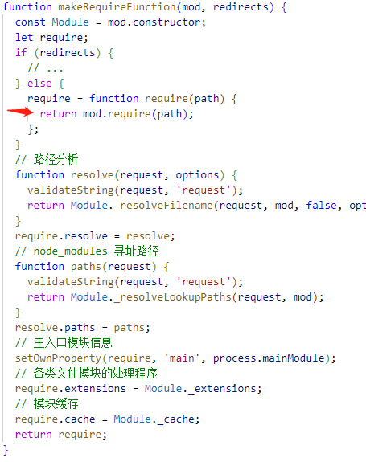
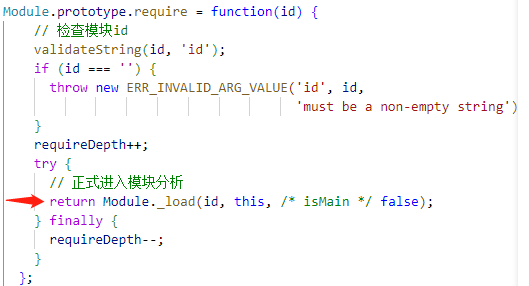

## 写在前面
Commomjs 和 ESM 是目前 JavaScript 中最常用的两种模块化规范，深入了解其核心机理可以有效加深我们对模块化的理解，话不多说，先看题目。

### Commonjs 案例
+ a.js 文件
```js
console.log('a.js 开始执行');
exports.done = false;
let {done: bDone} = require('./b.js');
console.log('in a，b.done =', bDone);
exports.done = true;
console.log('a.js 执行完毕');
```
+ b.js 文件

```js
console.log('b.js 开始执行');
exports.done = false;
let {done: aDone} = require('./a.js');
console.log('in b，a.done =', aDone);
exports.done = true;
console.log('b.js 执行完毕');
```
+ index.js 文件
```js
const a = require('./a')
const b = require('./b')
console.log(a,b)
```

若此时执行 index.js 文件，控制会依次输出什么那？

### ESM 案例
+ a.js 文件
```js
console.log('a.js 开始执行');
export var done = false;
import { done as bDone } from './b.js';
console.log('in a, b.done =', bDone);
done = true;
console.log('a.js 执行完毕');
```
+ b.js 文件

```js
console.log('b.js 开始执行');
export let done = false;
import { done as aDone } from './a.js';
console.log('in b, a.done =', aDone);
done = true;
console.log('b.js 执行完毕');
```
+ index.js 文件
```js

import * as a from "./a.js";
import * as b from "./b.js";

console.log(a, b);
```

若此时执行 index.js 文件，控制台又会输出什么那？

> Tips: 该题此时会抛出错误，你能解释错误原因并修改程序吗？

### 案例小结
这里先不揭晓答案，咱们先来分析一下这两段代码的核心问题。两段代码本质是类似的，但是使用的规范不同，因此两者实现和结果都会有略微差异。

案例情形是这样的：
+ 循环依赖: a.js 依赖于 b.js，b.js则又依赖于 a.js，两者构成了一个简单的循环依赖。
+ 重复加载: index.js 中分别导入了 a.js 与 b.js，而a，b两模块间存在循环依赖，再导入会造成重复加载问题。

也就是说，上面的案例共同的核心在于循环依赖和重复加载，这两者都是项目开发中不可避免地痛点问题。

在大型项目中，模块之间的依赖关系可能非常复杂，就像是一张错综复杂的交错网络。有时候，两个或多个模块之间会形成相互依赖的关系，就像是朋友间互相需要对方的帮助。但是，如果两个人都需要对方的帮助，而又没有帮助的先后顺序，就会形成僵局，直到最终变得越来越糟糕。这就是循环依赖的危险所在，如果处理不当，程序就会不断递归加载，直到崩溃。


重复加载也是类似的情形，多个模块可能会依赖同一个模块，如果每个模块都去加载和解析同一个模块，会浪费大量的时间和计算资源，同时也会增加代码的体积和维护成本。这就好比每次去超市买东西时，只是单纯的购物，并不会记住商品的大致分布，这就导致每次去超市都像无头苍蝇一样从头开始找，不仅浪费时间，还会给我们的生活带来很多不必要的麻烦。


下面我们就一起来看看Commonjs 和 ESM 内部是如何处理循环依赖和重复加载的？


## Commonjs 机理
### 前置知识

Commonjs 规范规定，一个文件即为一个模块，如何找到这个文件，又该如何加载这个文件成为 Commonjs 规范的核心问题。

根据这两个问题，Nodejs 实现了自身的 Commonjs 规范，模块引入过程可以分为三步
+ 模块分析
+ 模块寻址
+ 编译执行

Nodejs中将模块，根据加载标识符的不同，可以将模块分为三类
+ 文件模块: 以 ./ 或者 ../ 等相对路径前缀开头标识，或者以 / 等绝对路径开头表示
+ 内置模块: 官方内置的模块，例如 fs、path 等可以直接使用的模块
+ 第三方模块: 非路径格式也非核心模块


内置模块内嵌在 Nodejs 源码中，Nodejs 启动时会直接被加载到内存中，加载时无需进行模块寻址，加载速度快。

文件模块和第三方模块则需要运行时进行加载，需要执行三步走步骤，加载速度相对较慢。

模块类型不同，Commonjs的加载规则也略有不同，下面一起来调试 Nodejs 源码，理解一下Commonjs是如何加载不同类型模块的。


### 环境配置
> 最新版本Nodejs v

首先借助 VSCode 创建一个launch.json，同时注释掉 skipFiles 的内容，注意不要直接删除，VSCode内部会有默认配置，删除不生效。


```json
{
    "version": "0.2.0",
    "configurations": [
        {
            "type": "node",
            "request": "launch",
            "name": "启动程序",
            "skipFiles": [
                // "<node_internals>/**"
            ],
            "program": "${workspaceFolder}\\code\\4.module-core\\commonjs-load\\load.js"
        }
    ]
}
```

然后建立一个 commomnjs-load 文件夹，里面共两个 js 文件

```js
// module.js
module.exports.name = 'zcxiaobao';

// load.js
const { name } = require('./module'); // debugger
console.log(name);
```

点击调试，开始源码之旅吧。

```js
function Module(id = '', parent) {
  this.id = id;
  this.path = path.dirname(id);
	// 在模块中使用的 modules.export = Module 本身，而 exports 是Module的一个属性
  this.exports = {};
  moduleParentCache.set(this, parent);
  updateChildren(parent, this, false);
  this.filename = null;
  this.loaded = false;
  this.children = [];
}
```

### 模块分析
首先会调用 makeRequireFunction 函数中的 require 方法，传递当前模块路径 `./module`。




然后我们就进入 Module 构造函数原型方法 require 中，继续调试进入 Module._load 方法




Module._load 方法真的是 Commonjs 实现过程中少有的良心源码了，附带了详细的注释，通过注释，我们基本可以了解主要逻辑：

+ 首先检查缓存中是否存在所请求的文件，如果缓存中存在，则返回其 exports 对象；
+ 其次若为内置模块，则调用 `BuiltinModule.prototype.compileForPublicLoader()` 并返回 exports；
+ 否则，为该文件创建一个新模块并保存到缓存中，加载文件内容，返回 exports 对象。

Module._load 函数内容较长，这里咱们把它拆分一下。

nodejs在后期演变过程中，扩展了内置模块的引用方式，允许以 `node:` 为前缀，加载内置模块。

```js
// node 高版本新提出，可以通过 node:: 前缀加载用户侧可加载的内置模块
if (StringPrototypeStartsWith(request, 'node:')) {
  // Slice 'node:' prefix
  const id = StringPrototypeSlice(request, 5);

  const module = loadBuiltinModule(id, request);
  if (!module?.canBeRequiredByUsers) {
    throw new ERR_UNKNOWN_BUILTIN_MODULE(request);
  }

  return module.exports;
}
```
在 Nodejs 中，模块加载存在缓存机制，对同一文件的重复加载一律返回缓存，由于文件绝对路径不会发生重复，以此作为缓存的key。

```js
// 获取文件的绝对路径，作为缓存 key；后续会详解该方法
const filename = Module._resolveFilename(request, parent, isMain);
// 获取缓存
const cachedModule = Module._cache[filename];
// 缓存中存在该模块
if (cachedModule !== undefined) {
    updateChildren(parent, cachedModule, true);
    // 如果要加载的模块缓存已经存在，但是并没有完全加载好（循环依赖关键）
    // 后面会返回来讲这个地方
    if (!cachedModule.loaded) {
      const parseCachedModule = cjsParseCache.get(cachedModule);
      if (!parseCachedModule || parseCachedModule.loaded)
        return getExportsForCircularRequire(cachedModule);
      parseCachedModule.loaded = true;
    } else {
      // 如果已经加载完毕，直接返回 exports 对象即可
      return cachedModule.exports;
    }
  }
```
检查完缓存后，进行内置模块判断。Nodejs 源码中自带一份内置模块 map，只需去map中搜索一番，即可得出是否为内置模块，loadBuiltinModule 的逻辑还是比较简单的。

```js
// 检测是否为内置模块
const mod = loadBuiltinModule(filename, request);
if (mod?.canBeRequiredByUsers &&
    BuiltinModule.canBeRequiredWithoutScheme(filename)) {
  return mod.exports;
}

function loadBuiltinModule(filename, request) {
  const mod = BuiltinModule.map.get(filename);
  if (mod?.canBeRequiredByUsers) {
    debug('load built-in module %s', request);
    // compileForPublicLoader() throws if mod.canBeRequiredByUsers is false:
    mod.compileForPublicLoader();
    return mod;
  }
}
```
未命中缓存，也没匹配到原生模块，因此创建一个新的 Module 实例，绝对路径为 key，存储到缓存中

```js
const module = cachedModule || new Module(filename, parent);
Module._cache[filename] = module;
```
代码到这里，我们已经获取模块文件地址及模块实例，接下来就需要将模块文件的内容加载进来。

文件的加载存在失败的可能，`Module._cache[filename] = module` 未加载便写入缓存存在一定的安全隐患，因此在这里官方添加了一个锁 threw。

```js
let threw = true;
try {
  // 加载模块
  module.load(filename);
  threw = false;
} finally {
  // 如果加载失败，删除缓存
  if (threw) {
    delete Module._cache[filename];
  } else if (module.exports &&
              !isProxy(module.exports) &&
              ObjectGetPrototypeOf(module.exports) ===
                CircularRequirePrototypeWarningProxy) {
    ObjectSetPrototypeOf(module.exports, ObjectPrototype);
  }
}
// 返回 module.exports 对象
return module.exports;
```

模块分析的部分到这里就结束了，这里我们画图小结一下整体流程:


在调试代码之前，我们提出几个问题，带着问题来更好的理解源码流程
1. Commonjs 规范中规定，一个文件为一个模块，所以说无论是那种类型的模块，最终都需要落实到某一文件上，那么这个文件是如何**寻址**到的那？
2. Commonjs 通过何种方式构建了模块内部变量的作用域，来实现变量封装、避免全局污染等问题？
3. 

然后下面咱们就开始一起进行调试，由于源码内容相对还是比较复杂，因此在这个调试过程，我会尽可能地简化代码，最快速度的让你抓住核心内容。

寻址过程中，如果遇到 node_modules ，除非找到对应包，否则不会停止，会一直向上

流程

mod.require --- Module.prototype.require
Module._load
    + StringPrototypeStartsWith(request, 'node:')
    + Module._resolveFilename
      + Module._resolveLookupPaths
    + Module._cache
    + Module._cache[filename] = module;
    + Module.load(filename);
      + const extension = findLongestRegisteredExtension(filename)
      + Module._extensions[extension](this, filename);
        + Module._extensions['.js']
          + content = fs.readFileSync(filename, 'utf8');
        + module._compile
          + const compiledWrapper = wrapSafe(filename, content, this);
            + internalCompileFunction --> function
          + ReflectApply
    + return module.exports;

### 模块寻址
模块分析的核心任务便是**区分开加载的模块类型**，模块类型不同，加载方式有所不同。对于内置模块，我们直接返回内置的 exports 即可，而对于文件模块和第三方模块，就没有这么简单了。

Commonjs 规范规定一个文件即为一个模块，模块的加载本质上是加载对应模块文件，如何找到这个关键是模块能否成功加载的关键。

日常开发中我们通常可以这样使用:
```js
// 加载文件模块
const moduleA = require('./moduleA')
const moduleB = require('./moduleB.js')
// 加载第三方模块
const vue = require('vue')
```
可以发现，我们使用时，文件模块可以带后缀名，同样也可以不带后缀名，第三方模块的加载直接使用对应模块名即可，这是如何实现的呐？


在 Nodejs 早期版本中，寻址逻辑大致是这样的
+ 若是以 `./` 或者 `../` 等相对路径为前缀，则认为是相对路径模式文件模块，以当前模块文件为源头来寻址
+ 否则，该模块为内置模块或者第三方模块
  + 检测该模块是否为用户侧可加载的内置模块，若是，直接使用
  + 否则从当前文件目录开始，在寻找 node_modules 中寻找对应模块
  + 如果没找到，继续去上级目录下的 node_modules 中寻找
  + 重复上面步骤，直至根目录

现在 Nodejs 的寻址进一步完善了早期的寻址逻辑。在 `_resolveFilename` 除加入断点，进入到该函数中。

首先同样添加了对 node: 前缀内置模块的检测，这部分类似于 Module._load 中。

```js
if (
    (
      StringPrototypeStartsWith(request, 'node:') &&
      BuiltinModule.canBeRequiredByUsers(StringPrototypeSlice(request, 5))
    ) || (
      BuiltinModule.canBeRequiredByUsers(request) &&
      BuiltinModule.canBeRequiredWithoutScheme(request)
    )
  ) {
  return request;
}
```

然后是一段[自定义基路径寻址]()逻辑，require 加载模块过程并不会用到，是给 require.resolve 函数用的，这里了解一下就可以。

```js

```

接下来就到了模块寻址的关键之处，`_resolveLookupPaths()` 函数，该函数负责生成模块的基路径数组，进入到该函数中看一下详情。

```js
Module._resolveLookupPaths = function(request, parent) {
  // 检测是否为内置模块
  if ((
    StringPrototypeStartsWith(request, 'node:') &&
    BuiltinModule.canBeRequiredByUsers(StringPrototypeSlice(request, 5))
  ) || (
    BuiltinModule.canBeRequiredByUsers(request) &&
    BuiltinModule.canBeRequiredWithoutScheme(request)
  )) {
    debug('looking for %j in []', request);
    return null;
  }

  // 检测是否为第三方模块
  if (StringPrototypeCharAt(request, 0) !== '.' ||
      (request.length > 1 &&
      StringPrototypeCharAt(request, 1) !== '.' &&
      StringPrototypeCharAt(request, 1) !== '/' &&
      (!isWindows || StringPrototypeCharAt(request, 1) !== '\\'))) {

    let paths;
    // parent.paths 存储了模块的一系列父路径
    if (parent?.paths?.length) {
      paths = ArrayPrototypeSlice(modulePaths);
      ArrayPrototypeUnshiftApply(paths, parent.paths);
    } else {
      paths = modulePaths;
    }

    return paths.length > 0 ? paths : null;
  }

  // 文件模块，基路径为当前模块目录地址
  const parentDir = [path.dirname(parent.filename)];
  return parentDir;
};
```
通过代码可以发现，基路径数组的逻辑类似于模块分析，根据模块类型不同，基路径有所不同
+ 如果为内置模块，无需基路径，因此返回 null
+ 如果不是以相对路径开头，代表为第三方模块
  + 此时基路径数组由 [parent.paths, modulePaths] 构成
    + modulePaths 存储了HOME 环境变量中 `.node_modules`、`.node_libararies`及 Global 安装目录等
    + parent.paths 为从当前路径开始的每一级目录加上 `node_modules`
  + 也就是说，第三方模块的基路径数组为从当前目录开始，直至根目录，依次寻找 node_modules 目录是否存在对应模块；全部失败后再去 node 的默认存储寻找
+ 否则，代表为文件模块，基路径为当前模块的目录地址


获取基路径数组后，寻址逻辑并没有结束，例如开发时我们写了两个文件模块 `a.js` 和 `a.json`，通过 `require('./a')` 引入，基路径数组通过 `'./a'` 来获取，无法区分后缀名，因此还需要进一步完善模块的详细路径，也就是 `_findPath` 函数，该函数接收三个参数，分别是待加载模块，基路径数组，是否为主入口模块。

这个函数处理的情况还是有点多的，咱们一步一步解剖一下:

Step1: 判断 request 是否为绝对路径，若是，说明它已经包含了基路径，将基路径置为空字符串
```js
Module._findPath = function(request, paths, isMain) {
  const absoluteRequest = path.isAbsolute(request);
  if (absoluteRequest) {
    paths = [''];
  } else if (!paths || paths.length === 0) {
    return false;
  }


  // 尝试每个基路径
  for (let i = 0; i < paths.length; i++) {
    // 检车对应基路径是否存在
    const curPath = paths[i];
    if (insidePath && curPath && _stat(curPath) < 1) continue;

    if (!absoluteRequest) {
      const exportsResolved = resolveExports(curPath, request);
      if (exportsResolved)
        return exportsResolved;
    }
    // 基路径 + request 组装成新路径
    const basePath = path.resolve(curPath, request);
    let filename;
    // 检测新路径的状态: 存在与否，若存在，是文件还是目录
    const rc = _stat(basePath);
    if (!trailingSlash) {
      if (rc === 0) {  // 代表为文件
        if (!isMain) {
          // 符号链接
          if (preserveSymlinks) {
            filename = path.resolve(basePath);
          } else {
            filename = toRealPath(basePath);
          }
        } else if (preserveSymlinksMain) {
          filename = path.resolve(basePath);
        } else {
          filename = toRealPath(basePath);
        }
      }

      if (!filename) {
        // 获取nodejs 支持的后缀名
        if (exts === undefined)
          exts = ObjectKeys(Module._extensions);
        // 挨着后缀名进行尝试
        filename = tryExtensions(basePath, exts, isMain);
      }
    }

    if (!filename && rc === 1) {  // Directory.
      // try it with each of the extensions at "index"
      if (exts === undefined)
        exts = ObjectKeys(Module._extensions);
      filename = tryPackage(basePath, exts, isMain, request);
    }

    if (filename) {
      Module._pathCache[cacheKey] = filename;
      return filename;
    }

    const extensions = [''];
    if (exts !== undefined) {
      ArrayPrototypePushApply(extensions, exts);
    }
    reportModuleNotFoundToWatchMode(basePath, extensions);
  }

  return false;
};
```
Step2: 从基路径数组 paths 中获取一个基路径，检测该路径是否有效。若有效，用基路径加上 request 组成一个新路径 basePath

```js
for (let i = 0; i < paths.length; i++) {
  const curPath = paths[i];
  // _stat 是 nodejs 内置的检测文件或者路径存在与否的方法
  if (insidePath && curPath && _stat(curPath) < 1) continue;

  const basePath = path.resolve(curPath, request);
}
```
其实源码在这里还有对高版本 Nodejs exports 字段的兼容，[exports]详情可以参考文档，如果 package.json 中配置了 exports 字段，这里会获取到对应路径信息，直接返回即可。

```js
if (!absoluteRequest) {
  const exportsResolved = resolveExports(curPath, request);
  if (exportsResolved)
    return exportsResolved;
}
```


Step3: 通过检查新路径最后一位是否为 `/`，来区分文件与目录
+ 若为文件，首先检测该文件是否存在，存在返回路径 filename
+ 若不存在，试图添加后缀名在尝试文件是否存在，若任一存在，返回 filename


```js
// 尝试每个基路径
for (let i = 0; i < paths.length; i++) {
  // 检车对应基路径是否存在
  const curPath = paths[i];
  if (insidePath && curPath && _stat(curPath) < 1) continue;

  if (!absoluteRequest) {
    const exportsResolved = resolveExports(curPath, request);
    if (exportsResolved)
      return exportsResolved;
  }
  // 基路径 + request 组装成新路径
  const basePath = path.resolve(curPath, request);
  let filename;
  // 检测新路径的状态: 存在与否，若存在，是文件还是目录
  const rc = _stat(basePath);
  if (!trailingSlash) {
    if (rc === 0) {  // 代表为文件
      if (!isMain) {
        // 符号链接
        if (preserveSymlinks) {
          filename = path.resolve(basePath);
        } else {
          filename = toRealPath(basePath);
        }
      } else if (preserveSymlinksMain) {
        filename = path.resolve(basePath);
      } else {
        filename = toRealPath(basePath);
      }
    }

    if (!filename) {
      // 获取nodejs 支持的后缀名
      if (exts === undefined)
        exts = ObjectKeys(Module._extensions);
      // 挨着后缀名进行尝试
      filename = tryExtensions(basePath, exts, isMain);
    }
  }
}
```

`Module._extensions` 是 Nodejs 模块化规范中一个很核心的实现理念，我们知道 Nodejs 可以处理三类文件: `.js`，`.json`，`.node`，此外还支持其他类型文件的扩展，各类文件的处理方法不尽相同，Nodejs 于是就定义了 `Module._extensions` 对象，键为后缀名，值为对应处理函数，也就是如下形式
```js
Module._extensions = {
  '.js'(){ /* JsFunc */ },
  'json'(){ /* JsonFunc */ },
  '.node'(){ /* NodeFunc */ },
}
```
通过 `ObjectKeys(Module._extensions)` 可以获取到键值，然后借助 `tryExtensions` 依次就行尝试，尝试的顺序默认按照键值的顺序，也就是 `'.js' -> '.json' -> '.node'`，这也就解释了当同时存在 index.js 和 index.json 时，默认都是先加载 index.js。

```js
function tryExtensions(p, exts, isMain) {
  for (let i = 0; i < exts.length; i++) {
    const filename = tryFile(p + exts[i], isMain);

    if (filename) {
      return filename;
    }
  }
  return false;
}
```

Step4: 若新路径为目录，则:
+ 若该目录下存在 package.json，尝试使用 main 字段，进行寻址
+ 若寻址失败，在新路径基础上尝试添加 `index+后缀名`


```js

if (!filename && rc === 1) {  // Directory.
  // try it with each of the extensions at "index"
  if (exts === undefined)
    exts = ObjectKeys(Module._extensions);
  filename = tryPackage(basePath, exts, isMain, request);
}

function tryPackage(requestPath, exts, isMain, originalPath) {
  const pkg = _readPackage(requestPath)?.main;

  if (!pkg) {
    return tryExtensions(path.resolve(requestPath, 'index'), exts, isMain);
  }

  const filename = path.resolve(requestPath, pkg);
  let actual = tryFile(filename, isMain) ||
    tryExtensions(filename, exts, isMain) ||
    tryExtensions(path.resolve(filename, 'index'), exts, isMain);
  // 精简部分不关键代码
  return actual;
}
```

Step5: 如果还没有寻址成功，则失败。

#### 模块寻址小结


### 核心实现
### 文件模块加载


## ESM 机理
