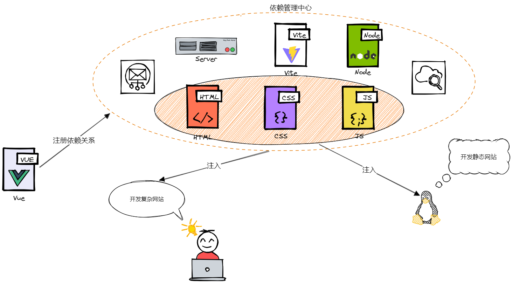

## 写在前面

> 本篇是前端工程化打怪升级的第 1 篇， [**小册传送门**](https://zcxiaobao.github.io/front-end-engineering-handbook/module/esm.html) | [**案例代码**](https://github.com/zcxiaobao/front-end-engineering-handbook/tree/main/code/1.no-module)

近几年，时常会感叹，前端，发展的太迅猛了。日新月异的新概念，异彩纷呈的新思想泉水般涌出；前端项目的复杂度、开发成本、维护难度也在不断提升，前端三件套开发模式(HTML-CSS-JS)滞后于前端的进步，这要求我们需要以更高层次的眼光来重新审视前端——工程化。工程化是一个工学概念，其核心是结合实际建立科学的、规范的设计和生产流程，目的是**降本提效**。

前端工程化目前还没有比较完善的定义，各种论调众说纷纭，很多朋友很容易把工程化与 webpack 画等号，这其实一种不完善的理解，以我看来**其是指借助科学的软件工程方法，更科学、严谨、系统的管理和维护整个前端开发的全流程**。又或者理解为比较主流的工程四化：**模块化、组件化、规范化、自动化**。

模块化是前端工程化的核心要素，重中之重，理解模块化是掌握工程化的重要一步。因此本文以早期模块化演变进程为着眼点，带你理解

- 什么是模块化
- 为什么需要模块化
- 早期模块化的演变进程
- 应用于模块化的依赖注入

## 模块化

维基百科的定义还是有几分难以理解，咱们用前端的话术修饰一下，模块化其实就是指解决一个复杂问题时**自顶向下逐层把系统划分成若干模块**的过程，每个模块完成一个特定的子功能（单一职责），**模块内部私有，对外暴露接口与其他模块通信**，所有的模块按某种方法组装起来，成为一个整体，从而完成整个系统所要求的功能。

还是有些难以理解，举一个现实中的栗子，火箭系统就是比较典型的模块化设计，一般会有三大模块：控制、动力、结构。三个模块各司其职；同时也存在部分的依赖关系，例如控制是核心模块，需要操纵结构模块与动力模块。


<!--  -->

那么模块化有什么好处那？从火箭案例可以发现，各自模块都拥有自身的核心业务，擅长结构的从事结构模块研究，精研控制的设计控制程序，各司其职，模块化设计是一种降本提效的好方案。在前端中亦是如此，具体的好处小包暂且不多言，下面一起来经历模块化的演变过程，在此之后，你会有更深刻的理解。

<!-- ## 早期模块化演变进程 -->

## 文件划分

在早期刀耕火种的前端三件套时代，HTML 中通过引入到多个不同逻辑的 js 文件，构成了最原始的模块化实现方式——文件划分模式。

```js
// moduleA.js
let moduleName = "moduleA";
```

```js
// moduleB.js
let getModuleName = () => {
  console.log("This is moduleB!");
};
```

```js
// entry.js
console.log(moduleName); // moduleA
getModuleName(); // This is moduleB!
```

```html
<!DOCTYPE html>
<html lang="en">
  <head>
    <meta charset="UTF-8" />
    <meta http-equiv="X-UA-Compatible" content="IE=edge" />
    <meta name="viewport" content="width=device-width, initial-scale=1.0" />
    <title>Document</title>
  </head>
  <body>
    <script src="./moduleA.js"></script>
    <script src="./moduleB.js"></script>
    <script src="./entry.js"></script>
  </body>
</html>
```

上述案例代码中，entry.js 分别使用了 `moduleA`、`moduleB` 的变量与函数，实现了简易的代码分离与组织，但随着代码量的增大及项目复杂度的增加，文件划分方式存在很多问题。

- **命名冲突**: `moduleA` 和 `moduleB` 定义在全局，并没有构造私有空间，如果 `moduleB` 同时定义了 `moduleName`，两个模块间就会发生变量名的覆盖，引起变量冲突
- **依赖模糊**: 无法清晰的确定模块之间的依赖关系和加载顺序。文件划分方式中被依赖项需要引用在前，也就是说 script 引入顺序仅仅提供了某些 js 文件的前后依赖，并不能确切的反应各模块间的依赖关系。
- **维护性差**: 代码间组织方式混乱，后期维护难度较高
- **复用性差**

文件划分模式的缺点简直可以举一大箩筐，后续模块化的演变正是对缺点的不断优化。

## 命名空间

命名空间是另一种模块化的实现方案，其目的在于解决**命名冲突**问题。

命名空间的核心实现在于将变量与函数声明为对象的属性，只要外层对象命名不发生冲突，内部的成员就不会发生覆盖。

```js
// moduleA.js
let moduleA = {
  moduleName: "moduleA",
  getModuleName() {
    return this.moduleName;
  },
};
```

```js
// moduleB.js
let moduleB = {
  moduleName: "moduleB",
  getModuleName() {
    return this.moduleName;
  },
};
```

```js
// entry.js
console.log(moduleA.getModuleName()); // moduleA
console.log(moduleB.getModuleName()); // moduleB
```

命名空间的写法一定程度上减少了命名冲突问题，但其本质写法为对象，并没有构建私有作用域，所有模块的成员可以被外部访问，这违背了模块化的设计理念，同时也无法管理模块间的依赖问题。

```js
// entry.js
moduleA.moduleName = "alterModule";
moduleA.getModuleName(); // alterModule
```

## IIFE

JavaScript 中函数可以生成函数作用域，外部无法访问内部定义的成员，**使用闭包思想，可以将内部成员暴露给外部使用**。因此可以借助**函数+闭包**特性实现私有数据和共享方法，由于该函数只是为了辅助模块化的实现，因此采用 `IIFE` 立即执行函数的模式。

当外部使用 `IIFE` 构建的模块时，只能通过模块提供的接口进行操作，无法访问私有成员。这种方式成功的解决了命名冲突以及私有空间的问题，同时也是现代模块化规范的思想来源。

```js
// moduleA.js
let moduleA = (function () {
  const _moduleName = "moduleA";
  const getModuleName = function () {
    return _moduleName;
  };
  return { getModuleName };
})();
```

```js
// moduleB.js
let moduleB = (function () {
  const _moduleName = "moduleB";
  const getModuleName = function () {
    return _moduleName;
  };
  return { getModuleName };
})();
```

```js
// entry.js
console.log(moduleA.getModuleName()); // moduleA
console.log(moduleB.getModuleName()); // moduleB

moduleA._moduleName = "alterModule";
console.log(moduleA.getModuleName()); // moduleA
```

新的问题来了，`IIFE` 方式可以解决依赖问题吗？

这时可以使用引入依赖，即通过 **IIFE 的函数参数**将依赖传入。

```js
// moduleC.js
let moduleC = (function () {
  const _moduleName = "moduleC";
  const _moduleData = { x: 1 };
  const getModuleData = function () {
    console.log("Module: ", _moduleName, " Data: ", _moduleData.x);
  };
  return { getModuleData };
})();
```

```js
// moduleA.js
let moduleA = (function (module) {
  const _moduleName = "moduleA";
  const getModuleName = function () {
    console.log(_moduleName);
    console.log(module.getModuleData());
  };
  return { getModuleName };
})(moduleC);
```

```js
// entry.js

// Module:  moduleC  Data: 1
console.log(moduleA.getModuleName()); // moduleA
console.log(moduleB.getModuleName()); // moduleB
```

`IIFE` 方式大家其实都不陌生，jQuery 时期有很多类似的实现，例如 jQuery 源码如何将 $ 挂载到 window 实例上(换个角度可以理解为依赖了 jquery 模块)。

```js
(function (global, factory) {
  "use strict";
  factory(global);
})(typeof window !== "undefined" ? window : this, function (window, noGlobal) {
  function jQuery() {}
  window.jQuery = window.$ = jQuery;
  return jQuery;
});

console.log(window.$); // function jQuery(){}
```

## 依赖注入

在 `IIFE` 方式之后，后续又出现了多种模块化方案，例如模板定义依赖、注册定义依赖、Sandbox 模式、依赖注入。

依赖注入的作为重要的开发思想，解耦大杀器，目前已经遍布前端世界，vue3、react、angular、nest 等都有使用，因此本文来特地讲解一下。

先来看看相关的几个重要概念:

### 依赖倒置原则

依赖倒置原则(Dependence Inversion Principle，DIP): 高层模块不应该依赖底层模块，两者都应该依赖其抽象，抽象不能够依赖于具体 ，具体必须依赖于抽象。


<!--  -->

举个栗子，假设我们是一家微波炉生产商，我们有着成熟的上下游生产链，例如我们与微波炉核心模块供应商建立了合作关系。

```js
import MicroCoreS from "vendor";
class Microwave {
  constructor(brand) {
    this.core = new MicroCoreS();
    this.brand = "zcxiaobao";
  }
}
```

在我们创业初期，上述的实现完全可以满足我们的需求，但随着时代的发展，`codeS` 类型核心开始难以满足最新市场，因此核心模块供应商推出了 `codeL` 类型核心。

这时我们就可以发现，我们的基类 `Microwave` 被 `coreS` 锁住了，如果想要升级为 `coreL`，需要全部替换或者重新创建 `MicrowaveL` 基类，**牵一发而动全身**，低效高成本。

DIP 就是为了解决这个问题而提出的，我们重新回顾一下 DIP 的定义:

> 高层模块不应该依赖底层模块，两者都应该依赖其抽象，抽象不能够依赖于具体，具体必须依赖于抽象

因此在这里我们不再直接紧耦合于 `core` 的具体设计，而是引入基于 `core` 的抽象设计(接口)，通俗来讲即**微波炉核心的设计标准**。


<!--  -->

接下来不论供应商如何迭代升级，我们只需按照 `MicroCore` 的标准实现新核心即可。

从上面两张图可以清楚的看到，前者 `Microwave` 与 `coreS` 和 `coreL` 是紧耦合关系；后者 `Microwave、coreL、coreS` 共同依赖于抽象接口 `MicroCore`，实现了松耦合。

总结来说: **假设有两个类 classA 和 classB，如果 classA 依赖 classB，这便是紧耦合；如果 classA 依赖 interfaceB，而 classB 实现了 interfaceB，这便是依赖倒置。**

### 控制反转

控制反转(Inversion of Control，IOC)是面向对象编程中的一种设计原则，它通过反转调用方和被调用方之间的关系，实现解耦合。

### 依赖注入

依赖注入(Dependency Injection，DI)是 IOC 最常见的方式，通过**将被依赖对象的创建和管理由依赖方转移到外部容器(或者框架)，然后将依赖的对象注入到需要使用的地方**，实现解耦合。

微波炉的生产过程中，会需要多类组件，例如核心、外壳，各类组件也会依赖于其他组件，例如核心模块还会依赖于电导丝，电导丝还会有多种类型材料。诸如此类的生产关系，就会共同构建成一个复杂的依赖网络(Dependency Network)。


<!--  -->

```js
const microwave = new Microwave(
  new coreL(new ElectricConductor(new coreMaterial()), ...),
  ...
);
```

看完例子后，我们重新品味一下依赖注入的定义，可以得出两大核心点: **存储被依赖对象的外部容器，将依赖注入所需地方**。

<!-- 在设计一款微波炉之前，我们通常会设计好设计图纸，详细的描述了微波炉的各部组成，等各部分生产完毕后，根据图纸组装成各种微波炉。 -->

微波炉的生产过程类似于依赖注入过程，其全部模块就构成**存储被依赖对象的外部容器**。然后不同类型的微波炉使用不同的模块进行组装，例如电导丝 A 型与电导丝 B 型微波炉注入不同的电导丝模块。

### 实现

依赖注入是面向对象中常用的编程思想，因此上文主要以类和接口为切入点，更方便理解，那模块化中的依赖注入又是怎样的那？


<!--  -->

从图中案例我们可以清晰的理清模块化中的依赖注入。

- 开发静态网站：注入前端传统三件套即可
- 开发复杂网站: 依赖池全部注入，开发难度尚高，因此可以注册新的 vue 依赖

```js
// 具象化三大模块
function vue() {
  return {
    module: "vue",
    ability: "code module",
  };
}

function vite() {
  return {
    module: "vite",
    ability: "bunde module",
  };
}

function server() {
  return {
    module: "server",
    ability: "data module",
  };
}
```

假设现在有 `vue、vite、server` 三个模块，我们试图借助这三个模块开发一些有意思的网站，可以将依赖模块借鉴 `IIFE` 引入依赖的方式以函数参数传入。

```js
var developWeb = function (vue, vite, server) {
  let v = vue();
  let vi = vite();
  let s = server();
  console.log(v.ability, vi.ability, s.ability);
};
```

但问题来了，依赖的模块该如何进行管理那，例如后续开发需要依赖新的模块，只能修改函数参数或者构造新的函数，这可是大忌。

这时候，依赖注入闪亮登场，来分析一下实现要点。

- 可以实现依赖关系的注册(即 IOC 容器来存储所有的依赖)
- 依赖注入器可以接受一个函数，注入成功后返回一个可以获取所有依赖资源的函数
- 注入应保持被传递函数的作用域
- 被传递的函数应该能够接受自定义参数，而不仅仅是依赖描述

下面来简单实现一个依赖注册器 `injector`，`injector` 由依赖容器、注册依赖函数、依赖注入函数三部分组组成。对于 `resolve` 函数，`deps` 代表被依赖 `key` 数组，`func` 代表需要注入依赖的函数，`scope` 代表 `func` 函数作用域。

```js
const injector = {
  dependencies: {}, // 依赖管理中心
  register: function (key, value) {
    // 注册依赖关系
    this.dependencies[key] = value;
  },
  resolve: function (deps, func, scope) {}, // 依赖注入
};
```

`resolve` 函数目的在于将 `deps` 涉及的依赖注入到 `func` 函数中，实现并不复杂。首先根据 `deps` 数组将所需的依赖从 `dependencies` 取出添加到 `dependModule` 数组中，然后在返回的函数中使用 `apply` 方法传递 `scope` 作用域及其他参数。

```js
var injector = {
  dependencies: {},
  register: function (key, value) {
    this.dependencies[key] = value;
  },
  resolve(deps, func, scope) {
    const dependModule = [];
    for (let i = 0; i < deps.length; i++) {
      const d = deps[i];
      // 分析依赖是否存在，收集所需依赖
      if (this.dependencies[d]) {
        dependModule.push(this.dependencies[d]);
      } else {
        throw new Error(d + "依赖不存在");
      }
    }
    return function () {
      // 传递函数作用域
      // 接受其他参数
      func.apply(
        scope,
        dependModule.concat(Array.prototype.slice.call(arguments, 0))
      );
    };
  },
};
```

来看看使用:

```js
injector.register("vue", vue);
injector.register("vite", vite);

injector.resolve(["vue", "vite"], function (vue, vite) {
  let v = vue();
  let vi = vite();
  console.log(v.ability, vi.ability);
})();

// 传入其他参数
injector.resolve(["vue", "vite"], function (vue, vite, other) {
  let v = vue();
  let vi = vite();
  console.log(v.ability, vi.ability, other);
})("other");
```

到这里，实现了一个简单的依赖注入，但上述实现并不完美。例如使用时需要重复所需依赖两次，此外由于附加参数的存在，还不能混淆顺序。有兴趣的朋友们可以自己完善一下。

## 总结

模块化的演变是一个特别有意思的过程，前人们探索出数十种模块化方式，各种方式有其独特特点，其中也有相互借鉴，学习这个过程可以收获良多，也可以更好地体悟当下的模块化规范。


<!--  -->

早期的模块化方案并没有完善的解决模块化问题，随着前端工程化的推进，开源社区中陆续出现较为优秀且完善的模块化解决方案，随着 ES6 的出现，JavaScript 官方退出 ESM，标志着模块化正式进入成熟阶段，模块化已然不可或缺。

经过早期一系列的探索，后续又诞生了那些模块化规范那，敬请期待下章《群雄逐鹿，前端模块化路在何方？》

## 后语

我是  **战场小包** ，一个快速成长中的小前端，希望可以和大家一起进步。

如果喜欢小包，可以在  **[github](https://github.com/zcxiaobao)**  关注我，同样也可以关注我的小小公众号——**[小包学前端](https://zcxiaobao.gitee.io/wx-demo/wx.png)**。

一路加油，冲向未来!!!
